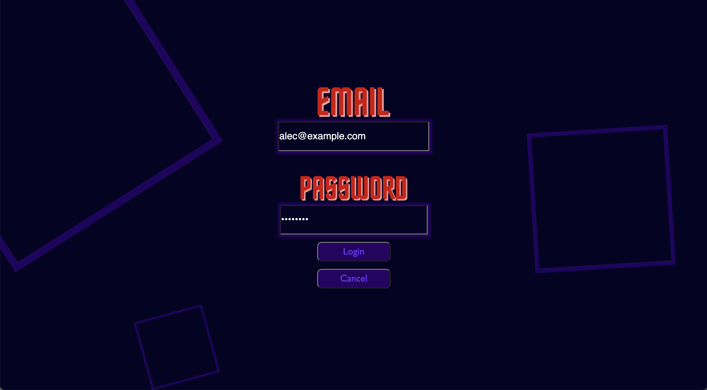
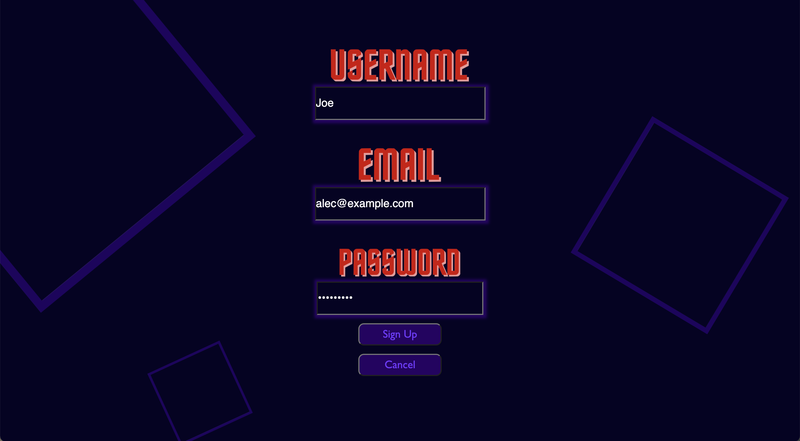

# Gym Club

A gym blog where gym junkies can meet, greet and share their insights and workout routines.

## Deployment

Gym Club has been deployed here:
[Gym Club](https://gym-club-28324.herokuapp.com)

## About

Track your progress and follow your favourite workout superstars on their journey and mimic their routines yourself! The project will be built using the MVC paradigm, utilising sequalize, node.js, express, handlebars and mySQL.

## Table of contents:

- [Installation](#installation)
- [Test](#tests)
- [Questions](#questions)

## Installation

The dependencies will all be in the package.json file. Please simply use "npm i" to install all required dependencies.

## Welcome Page

This is the page that most users are redirected to when they need to create an account or login

## Login

This is the login page

## Signup

This is the signup page

## Test

No tests as of yet.

## Questions

Github: https://github.com/thomas-nicholson
Github: https://github.com/SamuelHeal
Github: https://github.com/Punkinut
Github: https://github.com/Keerbi12

## End note

We hope you enjoyed going through our fitness social media platform :)
